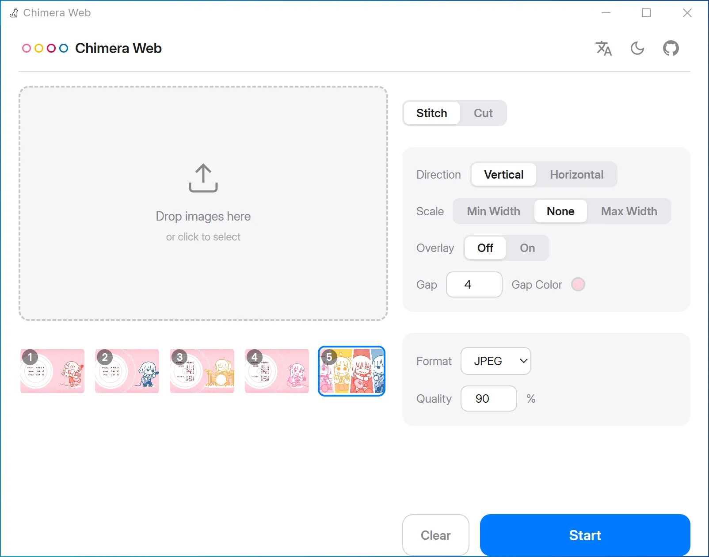

# Chimera Web

**English | [简体中文](README_CN.md)**

A lightweight desktop image stitching and cutting tool, all processing stays local.

> [!TIP]
> 
> **Try it online** (hosted by GitHub Pages, client-side only):  
> https://rerokutosei.github.io/ChimeraWeb/
> 
> For the Android version, visit https://github.com/ReRokutosei/Chimera

## Features

- **Stitch**: Combine multiple images vertically or horizontally, with configurable gap, fill color, and overlay mode.
- **Cut**: Split a single image into a 2×2 or 3×3 grid.
- **Scale**: Choose between min-width, no scale, or max-width alignment.
- **Formats**: Input/output support for JPEG, PNG, and WebP. Adjustable quality for JPEG/WebP.
- **Drag & drop**: Drop images directly onto the workspace or click to browse.
- **Dark mode**: Built-in light/dark theme toggle.
- **i18n**: English and Chinese (中文) interface.
- **Privacy**: No telemetry.

## Tech Stack

| Layer | Tech |
|-------|------|
| UI | HTML + CSS + TypeScript |
| Build | Vite |
| Image processing | Canvas API + `createImageBitmap` + `OffscreenCanvas` |
| Desktop wrapper | Tauri v2 (optional, Rust backend) |
| Storage | localStorage (settings) |

## Requirements

- **Chrome** Version 147 or higher. Other browsers not tested.
- **OS**: Windows 10 or later (x86_64)
- **Runtime**: WebView2 (pre-installed on Windows 10+)
- **Storage**: ~10 MB disk space for the app

## Getting Started

```bash
npm install
npm run dev        # → http://localhost:19234
```

### Build for production

```bash
npm run build      # → dist/
```

### Build desktop installer (requires Rust)

```bash
npm run tauri build  # → src-tauri/target/release/bundle/nsis/
```

## Screenshots



## Legal & Privacy

- **Privacy Policy**: No network permissions requested; zero data collection. All processing remains local. See [Privacy Policy](./PrivacyPolicy_EN.md).
- **Disclaimer**: Provided "as is" without warranty. See [Disclaimer](./Disclaimer_EN.md).
- **License**: Licensed under the GNU General Public License v3.0 (GPLv3). See [LICENSE](../LICENSE).

## Acknowledgments

App icon designed by [Freepik](https://www.freepik.com/icon/animal_13228011).