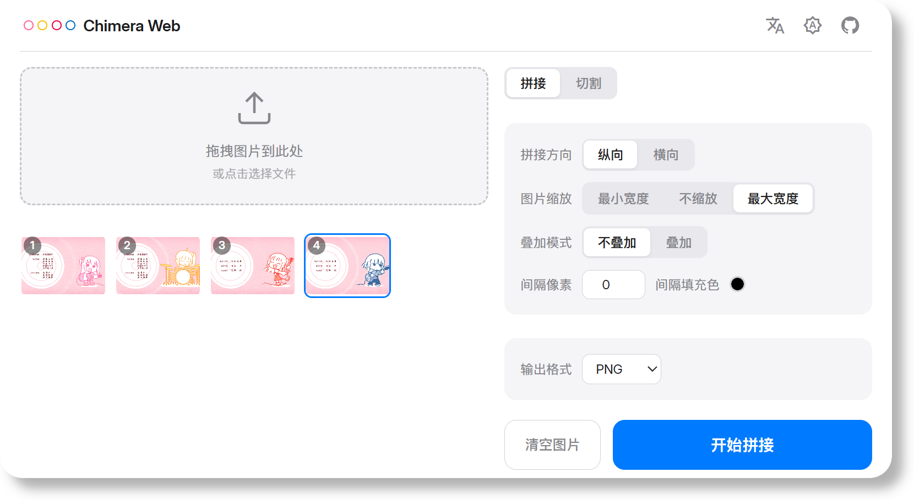
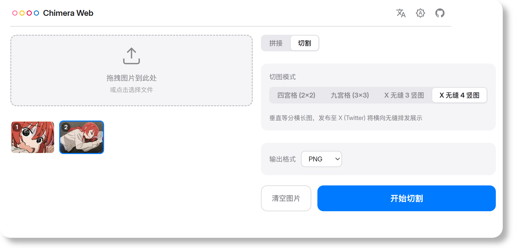

# Chimera Web

<div align="center">


[](https://app.fossa.com/projects/git%2Bgithub.com%2FReRokutosei%2FChimeraWeb?ref=badge_shield)

**[English](README.md) | 中文 | [日本語](README_JA.md) | [한국어](README_KO.md)**

轻量级桌面图片拼接与切割工具，所有处理均在本地完成

</div>

> [!TIP]
>
> **在线预览**（由 GitHub Pages 提供，纯前端）：  
> https://rerokutosei.github.io/ChimeraWeb/
> 
> 安卓端请前往 https://github.com/ReRokutosei/Chimera

## 功能

- **拼接**：将多张图片纵向或横向合成为一张，支持间隔像素、填充色和叠加模式
- **切割**：支持 2×2、3×3 宫格切图以及 1×3、1×4 全景等分切图（支持单张导出与 ZIP 批量打包下载）
- **缩放**：可选择最小宽度对齐、不缩放或最大宽度对齐
- **格式**：输入/输出支持 JPEG、PNG、WebP（JPEG/WebP 可调节输出质量）
- **拖拽**：将图片直接拖入工作区，或点击选择文件
- **深色模式**：内置亮色/暗色主题切换
- **多语言**：支持简体中文、英文、日文和韩文
- **隐私**：完全离线客户端处理，无遥测

## 预览

<div align="center">
  
  <br>
  
</div>

## 技术栈

| 层 | 技术 |
|-------|------|
| UI | HTML + CSS + TypeScript |
| 构建 | Vite |
| 图片处理 | Canvas API + `createImageBitmap` + `OffscreenCanvas` |
| 桌面包装 | Tauri v2（可选，Rust 后端） |
| 存储 | localStorage（设置项） |

## 安装要求

- **系统**：Windows 10 或更高版本（x86_64）
- **Chrome**: 147+，其他浏览器请自行测试
- **Runtime**：WebView2（Windows 10+ 已预装）
- **存储**：应用本体约 10 MB

## 快速开始

```bash
npm install
npm run dev        # → http://localhost:19234
```

### 构建生产版本

```bash
npm run build      # → dist/
```

### 构建桌面安装包（需 Rust）

```bash
npm run tauri build  # → src-tauri/target/release/bundle/nsis/
```

## 法律与隐私

- **隐私政策**：本应用不请求网络权限，不收集任何用户隐私，所有操作均在本地完成，详见 [隐私政策](./PrivacyPolicy_CN.md)
- **免责声明**：应用按现状提供，不提供任何形式的担保，详见 [免责声明](./Disclaimer_CN.md)
- **许可证**：本项目采用 GNU 通用公共许可证第3.0版（GPLv3）授权，详见 [LICENSE](../LICENSE)

## 致谢

应用图标由 [Freepik](https://www.freepik.com/icon/animal_13228011) 设计
