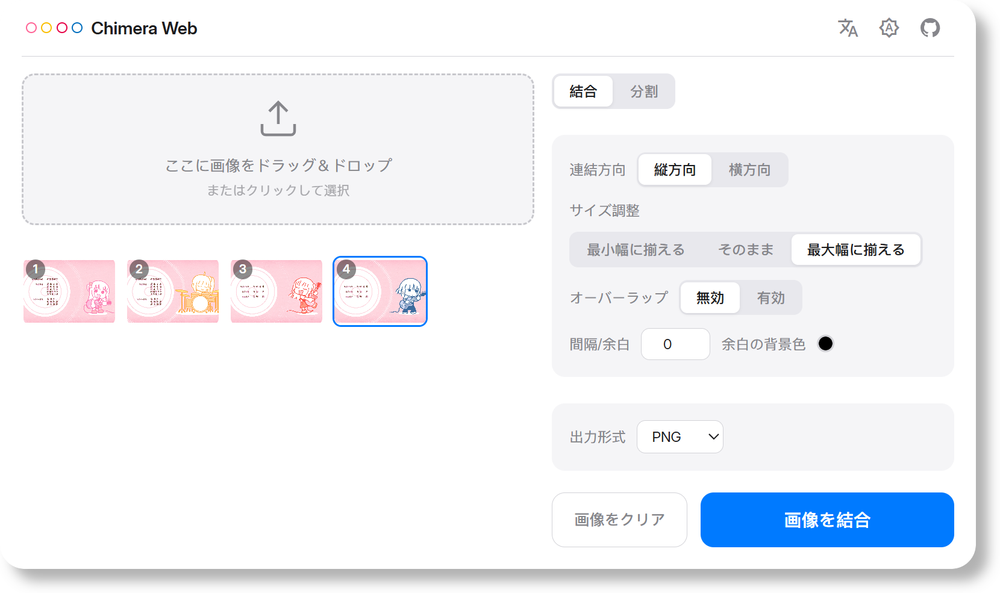
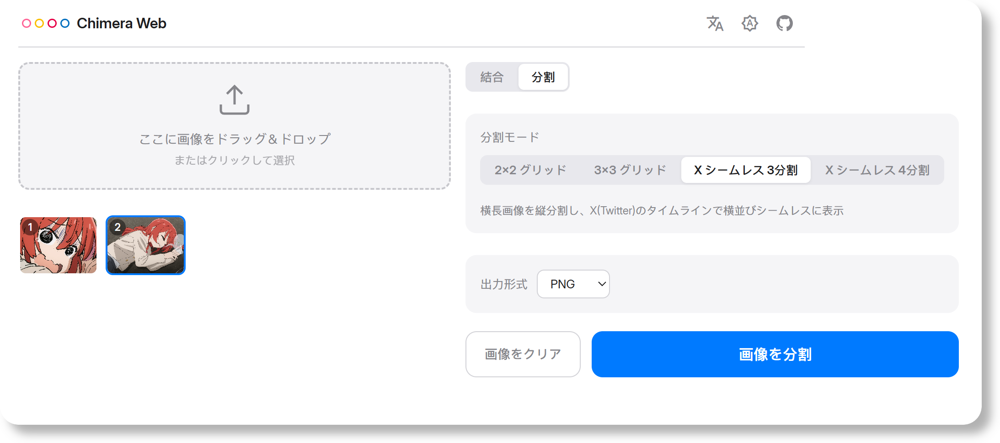

# Chimera Web

<div align="center">


[](https://app.fossa.com/projects/git%2Bgithub.com%2FReRokutosei%2FChimeraWeb?ref=badge_shield)

**[English](README.md) | [中文](README_CN.md) | 日本語 | [한국어](README_KO.md)**

完全ローカル処理で動作する、軽量なデスクトップ向け画像結合・分割ツール。

</div>

> [!TIP]
>
> **オンラインプレビュー**（GitHub Pages 提供、完全クライアントサイド）：  
> https://rerokutosei.github.io/ChimeraWeb/
> 
> Android 版はこちら：https://github.com/ReRokutosei/Chimera

## 機能

- **結合**：複数の画像を縦方向または横方向に結合。余白ピクセル、背景色、オーバーレイ比率を自由に設定可能
- **分割**：2×2、3×3 グリッド分割、および 1×3、1×4 のパノラマ等幅分割（個別ダウンロード・ZIP 一括保存に対応）
- **リサイズ**：最小幅に揃える、拡大縮小なし、最大幅に揃えるの 3 つのモードに対応
- **フォーマット**：JPEG、PNG、WebP の入出力に対応（JPEG / WebP の品質調整可能）
- **ドラッグ＆ドロップ**：画像をワークスペースに直接ドロップ、またはクリックしてファイル選択
- **ダークモード**：ライト／ダークテーマの切り替えに対応
- **多言語対応**：中国語、英語、日本語、韓国語をサポート
- **プライバシー**：完全オフライン・クライアントサイド処理、テレメトリ収集なし

## プレビュー

<div align="center">
  
  <br>
  
</div>

## 技術スタック

| レイヤー | 技術 |
|-------|------|
| UI | HTML + CSS + TypeScript |
| ビルド | Vite |
| 画像処理 | Canvas API + `createImageBitmap` + `OffscreenCanvas` |
| デスクトップラッパー | Tauri v2（任意、Rust バックエンド） |
| ストレージ | localStorage（設定保存） |

## 動作要件

- **OS**：Windows 10 以降（x86_64）
- **Chrome**：バージョン 147 以降（他のブラウザは未検証）
- **ランタイム**：WebView2（Windows 10+ は標準搭載）
- **ストレージ容量**：約 10 MB

## クイックスタート

```bash
npm install
npm run dev        # → http://localhost:19234
```

### プロダクションビルド

```bash
npm run build      # → dist/
```

### デスクトップ版インストーラーの作成（Rust が必要）

```bash
npm run tauri build  # → src-tauri/target/release/bundle/nsis/
```

## 法的情報とプライバシー

- **プライバシーポリシー**：本アプリはネットワーク権限を要求せず、ユーザー情報を一切収集しません。すべての処理はローカルで完結します。詳細は [プライバシーポリシー](./PrivacyPolicy_CN.md) をご覧ください。
- **免責事項**：本アプリは現状有姿で提供され、いかなる保証も行いません。詳細は [免責事項](./Disclaimer_CN.md) をご覧ください。
- **ライセンス**：本プロジェクトは GNU General Public License v3.0（GPLv3）の下で公開されています。詳細は [LICENSE](../LICENSE) をご覧ください。

## クレジット

アプリのアイコンは [Freepik](https://www.freepik.com/icon/animal_13228011) によってデザインされました。
