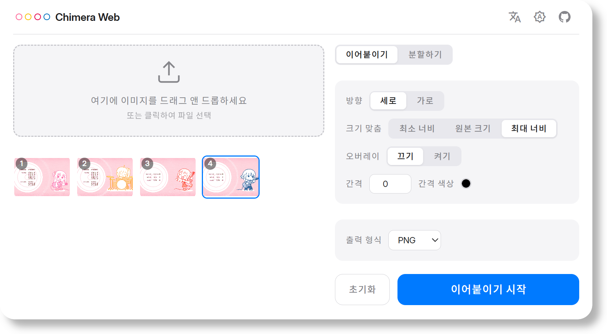
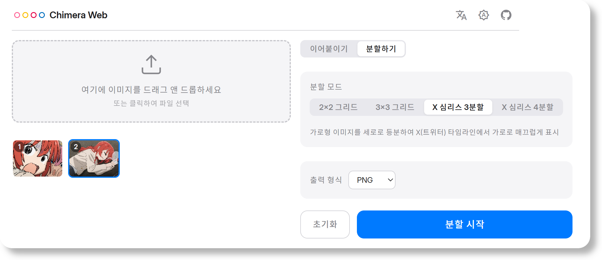

# Chimera Web

<div align="center">


[](https://app.fossa.com/projects/git%2Bgithub.com%2FReRokutosei%2FChimeraWeb?ref=badge_shield)

**[English](README.md) | [中文](README_CN.md) | [日本語](README_JA.md) | 한국어**

모든 처리가 로컬 기기에서 안전하게 완료되는 가볍고 빠른 데스크톱 이미지 병합 및 분할 도구.

</div>

> [!TIP]
>
> **온라인 체험** (GitHub Pages 제공, 완전한 클라이언트 사이드):  
> https://rerokutosei.github.io/ChimeraWeb/
> 
> Android 버전은 여기를 방문하세요: https://github.com/ReRokutosei/Chimera

## 주요 기능

- **병합 (Stitch)**: 여러 이미지를 세로 또는 가로로 합성, 간격(px), 채우기 색상 및 오버레이 비율 설정 지원
- **분할 (Cut)**: 2×2, 3×3 그리드 분할 및 1×3, 1×4 파노라마 등분 분할 (개별 다운로드 및 ZIP 일괄 압축 저장 지원)
- **크기 조정**: 최소 너비 맞춤, 크기 유지, 최대 너비 맞춤의 3가지 스케일 모드 지원
- **포맷**: JPEG, PNG, WebP 입력/출력 지원 (JPEG/WebP 압축 품질 조절 가능)
- **드래그 앤 드롭**: 이미지를 작업 영역에 바로 끌어다 놓거나 클릭하여 파일 선택
- **다크 모드**: 라이트/다크 테마 원클릭 전환
- **다국어 지원**: 한국어, 영어, 중국어, 일본어 인터페이스 지원
- **개인정보 보호**: 완전한 오프라인 클라이언트 사이드 처리, 텔레메트리 미수집

## 미리보기

<div align="center">
  
  <br>
  
</div>

## 기술 스택

| 레이어 | 기술 |
|-------|------|
| UI | HTML + CSS + TypeScript |
| 빌드 | Vite |
| 이미지 처리 | Canvas API + `createImageBitmap` + `OffscreenCanvas` |
| 데스크톱 패키징 | Tauri v2 (선택 사항, Rust 백엔드) |
| 저장소 | localStorage (설정 저장) |

## 시스템 요구사항

- **운영체제**: Windows 10 이상 (x86_64)
- **Chrome**: 버전 147 이상 (기타 브라우저는 테스트되지 않음)
- **런타임**: WebView2 (Windows 10+ 기본 탑재)
- **저장 공간**: 약 10 MB

## 빠른 시작

```bash
npm install
npm run dev        # → http://localhost:19234
```

### 프로덕션 빌드

```bash
npm run build      # → dist/
```

### 데스크톱 설치 프로그램 빌드 (Rust 필요)

```bash
npm run tauri build  # → src-tauri/target/release/bundle/nsis/
```

## 법적 고지 및 개인정보 보호

- **개인정보 처리방침**: 본 앱은 네트워크 권한을 요청하지 않으며 어떠한 사용자 정보도 수집하지 않습니다. 모든 작업은 로컬에서 수행됩니다. 자세한 내용은 [개인정보 처리방침](./PrivacyPolicy_CN.md)을 참조하세요.
- **면책 조항**: 본 앱은 어떠한 보증 없이 "있는 그대로" 제공됩니다. 자세한 내용은 [면책 조항](./Disclaimer_CN.md)을 참조하세요.
- **라이선스**: 본 프로젝트는 GNU General Public License v3.0 (GPLv3)에 따라 배포됩니다. 자세한 내용은 [LICENSE](../LICENSE)를 참조하세요.

## 감사의 말

앱 아이콘은 [Freepik](https://www.freepik.com/icon/animal_13228011)에 의해 디자인되었습니다.
